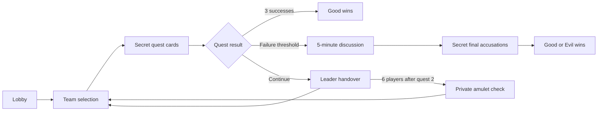

<div align="center">

# Quest Robot · 阿瓦隆2号

**A bilingual Discord game host for Quest.**  
**把隐藏身份桌游的完整流程带到 Discord。**


[English](#english) · [简体中文](#简体中文) · [Setup / 安装与操作](SETUP.md)

A personal project by [FrozenfireMinghang](https://github.com/FrozenfireMinghang).  
Inspired by [ShuzhaoFeng/discord-botc](https://github.com/ShuzhaoFeng/discord-botc).

</div>

## English

### What it does

Quest Robot hosts **Quest standard-edition games for 4, 5 or 6 human players** inside a Discord server. It manages the mechanics—from secret role assignment to the final verdict—so players can focus on discussion, bluffing and deduction.

Use slash commands to create a lobby, form teams and hand over leadership. Private buttons collect quest cards, and a private selection menu collects final accusations. Public updates show game progress without exposing unfinished secret choices.

### Features

| Feature | Implementation |
| --- | --- |
| Standard rules | Correct role distributions and quest sizes for 4–6 players; both four-player boards |
| Secret identities | Private role information, asymmetric Morgan/Scion knowledge, hidden Changeling |
| Quest resolution | Magic restrictions, Morgan’s exception, immutable submissions and aggregate results |
| Six-player amulet | Eligibility validation and private alignment inspection after quest 2 |
| Final phase | Five-minute discussion, simultaneous secret accusations and the all-Evil-leader exception |
| English + Chinese | Localized command descriptions, gameplay prompts, errors and rules; language switching |
| Saved games | Atomic local JSON saves and recovery after process restart |
| Multiple games | Separate state per server/channel |
| Solo simulation | Choose teams and Magic, then submit each virtual player’s card through private controls |

### Engineering decisions

**An explicit game state machine.** Each action validates its phase, actor and targets before it changes game state. The rules engine is independent of Discord, making edge cases testable without an external service.

**Public and private information have separate paths.** Role knowledge, amulet results and action controls use ephemeral replies. Public messages contain progress and resolved quest totals. Identities are revealed after the game ends.

**Persistence happens before confirmation.** State updates run against a copy and are written through a temporary file followed by rename. Invalid actions cannot leave a partially changed in-memory game. Completed card submissions are reduced to totals rather than kept in the quest history.

**Repeated and stale actions are rejected.** Private controls carry the game ID and quest index. The engine also checks phase, membership and duplicate submissions. A panel from an old game cannot submit into its replacement.

### Game flow



There is no team approval vote. One Fail defeats a quest at these player counts. Good wins at three successful quests; two failures at four players, or three at five/six, trigger the final phase.

### Run it locally

```sh
git clone https://github.com/FrozenfireMinghang/quest-robot.git
cd quest-robot
npm ci
cp .env.example .env
# Fill DISCORD_TOKEN, DISCORD_CLIENT_ID and DISCORD_GUILD_ID locally.
npm run register
npm start
```

Then create a game in Discord:

```text
/quest create players:5 language:en
/quest join
/quest start
/quest role
```

See [SETUP.md](SETUP.md) for bot invitations, required permissions, all commands and the standard rules.

### Try it solo

```text
/quest simulate players:4 language:en
/quest simulate-panel
```

Choose the team, assign Magic to a team member, then submit Success or Fail separately for each player. The panel disables illegal Fail choices and resolves the quest after everyone submits. Click **Assign next leader** to start the next round. The host can see all simulated roles and skip discussion time in simulations. See [SIMULATION.md](SIMULATION.md).

### Validation and current scope

The current version passes **28 automated tests** covering rule transitions, complete games, information privacy, persistence, authorization, localization and mocked Discord interactions. Run `npm test` and `npm run check` to verify it locally.

Live-server validation requires your own Discord credentials. This version uses existing text channels, one local writer process and human players. It does not include AI opponents, optional characters or Director’s Cut rules. The five-minute deadline is checked when a player uses `/quest final`; the bot does not mute people or auto-submit missing choices.

## 简体中文

### 项目介绍

Quest Robot 是我的个人 Discord 游戏机器人项目，为 **Quest 普通版 4、5、6 人局**提供完整的流程主持。从秘密发身份到最终胜负判定，机器人处理规则与状态，玩家专注于讨论、伪装和推理。

使用斜杠命令开局、组队和交接领袖；任务出牌通过私密按钮完成，最终指认通过私密选择菜单完成。公开频道展示游戏进度，未完成的秘密选择不会提前公开。

### 功能亮点

| 功能 | 实现内容 |
| --- | --- |
| 普通版规则 | 4–6 人角色配置和任务人数，支持四人局两种官方任务板 |
| 隐藏身份 | 身份仅本人可见；摩根与继承者的信息不对称；换形者保持隐藏 |
| 任务结算 | 魔法限制、摩根豁免、提交后锁定、统一公布结果 |
| 六人局护符 | 第二轮后分配，验证资格，只向持有人显示查验阵营 |
| 最终阶段 | 五分钟讨论、秘密同时指认、全部领袖为坏人的特殊判定 |
| 中英文支持 | 命令说明、游戏提示、错误和规则均支持中英文，房主可切换语言 |
| 游戏存档 | 本地 JSON 原子写入，进程重启后恢复游戏 |
| 多局隔离 | 按服务器与频道保存独立状态 |
| 单人模拟 | 私密菜单选队员、分配魔法，并逐个代虚拟玩家出牌 |

### 工程设计

**用明确的状态机表达游戏流程。** 每个操作先检查阶段、执行者权限和目标资格，再修改状态。规则引擎独立于 Discord，能够直接测试角色能力和复杂终局。

**区分公开进度与秘密信息。** 身份、护符结果与操作面板使用仅本人可见的回复；公开消息只包含进度和已结算的任务统计。游戏结束后才揭晓身份。

**先保存，再确认操作。** 修改在状态副本上执行，通过临时文件与重命名写入存档，避免无效操作留下部分修改。任务结算后只保留失败数量等汇总记录。

**防止重复提交与旧面板误操作。** 按钮包含游戏 ID 和轮次，规则引擎同时检查阶段、玩家资格和重复提交。上一局留下的面板不能影响新的一局。

### 一个人测试完整对局

```text
/quest simulate players:4 language:zh
/quest simulate-panel
```

通过私密面板依次选择队员、分配魔法，再逐个代玩家点击成功或失败。不能失败时按钮变灰；全部出牌后统一结算。点击 **交接下一任领袖** 进入下一轮。模拟局允许房主查看全部角色，并跳过讨论计时。完整说明见 [SIMULATION.md](SIMULATION.md)。

### 启动与验证

安装步骤与上方命令相同，在本地 `.env` 填写机器人 Token、应用 ID 和服务器 ID 后，执行 `npm run register` 和 `npm start`。

```text
/quest create players:5 language:zh
/quest join
/quest start
/quest role
```

完整邀请方法、权限、操作命令与规则见 [SETUP.md](SETUP.md)。当前版本已通过 **28 项自动化测试**，覆盖完整对局、规则边界、秘密信息、存档、权限、中英文与模拟 Discord 交互。执行 `npm test` 和 `npm run check` 可本地验证。

真实服务器联调仍需自己的 Discord 凭据。本版使用现有文字频道、本地单进程存档和真人玩家，不包含 AI 玩家、可选角色或导演剪辑版。最终讨论到时后，由玩家执行 `/quest final` 开启指认；机器人不会自动禁言或替缺席玩家提交。

## Project structure / 项目结构

```text
src/
  engine.js        Game rules and state transitions / 规则与状态转换
  interactions.js Discord commands and private controls / 命令与私密操作
  i18n.js          English and Chinese messages / 中英文消息
  store.js         Atomic persistence / 原子存档
  commands.js      Slash command definitions / 斜杠命令定义
  simulation.js    Host-controlled solo simulation / 房主控制的单人模拟
  register.js      Server command registration / 服务器命令注册
  bot.js           Gateway connection / Discord 连接入口
test/
  engine.test.js       Rules, complete games and persistence / 规则、完整对局与存档
  interactions.test.js Interaction privacy and authorization / 交互隐私与权限
  simulation.test.js   Solo games, Magic and separate cards / 单人对局、魔法与逐个出牌
```

## Inspiration & acknowledgements / 灵感与致谢

This project was inspired by **[ShuzhaoFeng/discord-botc](https://github.com/ShuzhaoFeng/discord-botc)**, a Discord bot for Blood on the Clocktower. Its approach to hosting a social-deduction game on Discord inspired this project’s direction. Quest Robot has its own implementation and game-specific rules engine; no source code was copied from that repository.

本项目的灵感来自 **[ShuzhaoFeng/discord-botc](https://github.com/ShuzhaoFeng/discord-botc)**。它将《血染钟楼》的流程搬到 Discord，启发了我制作 Quest 游戏机器人的方向。感谢原作者的分享。本项目独立实现了 Quest 的规则引擎与交互，没有复制该仓库的源代码。

Quest was designed by Don Eskridge. This is an unofficial fan project; game artwork and rulebook text are not bundled. / Quest 的设计者是 Don Eskridge。本项目是非官方爱好者项目，不包含游戏美术或规则书原文。
